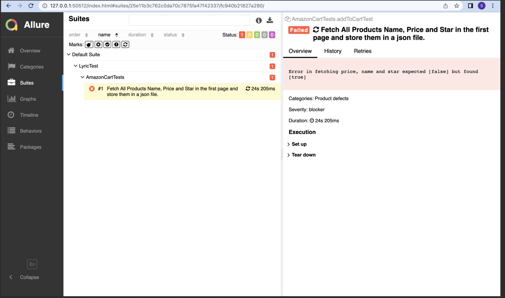
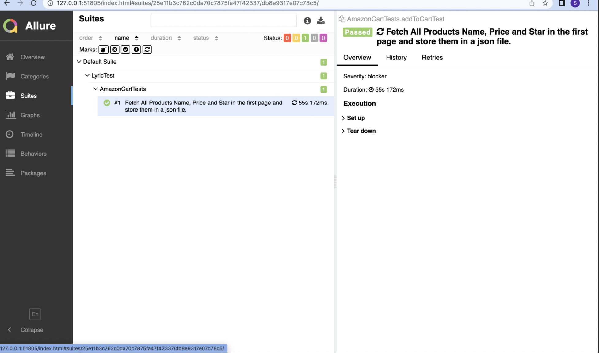
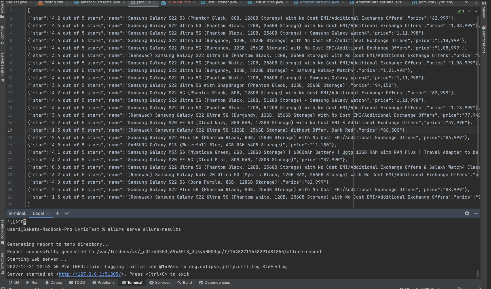
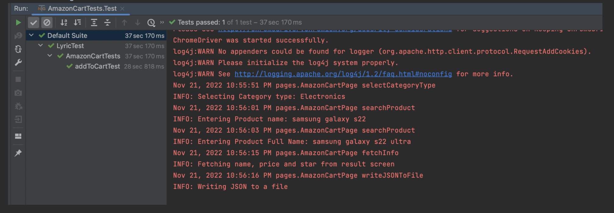

**```Amazon Cart UI automation using Selenium with Java```**

This is a sample project using page object model framework using selenium with java and maven.

**Dependency** : Java, Maven and Chrome version 107.0.5304.110

**Steps to clone the repo**
1. git clone https://github.com/jajoosaket/AmazonCart.git
2. cd AmazonCart.

**Steps to execute the tests**
1. Open the project.
2. Navigate to src/test/java/AmazonCartTests.java class.
3. Run the test case.


**Steps to generate allure report**
1. On mac  

   1.1 Open terminal.  

   1.2 brew install allure.  
   1.3 Go to project directory. 

   1.4 allure serve allure-results


A sample screenshot of failed run

A sample screenshot of passed run


Screenshot of json file where Products Name , Price and Star in the first page are store


Screenshot of logs 
